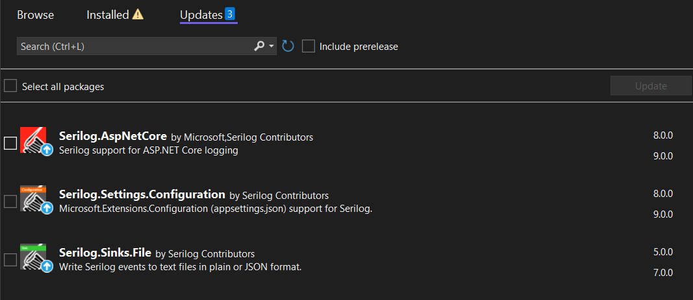
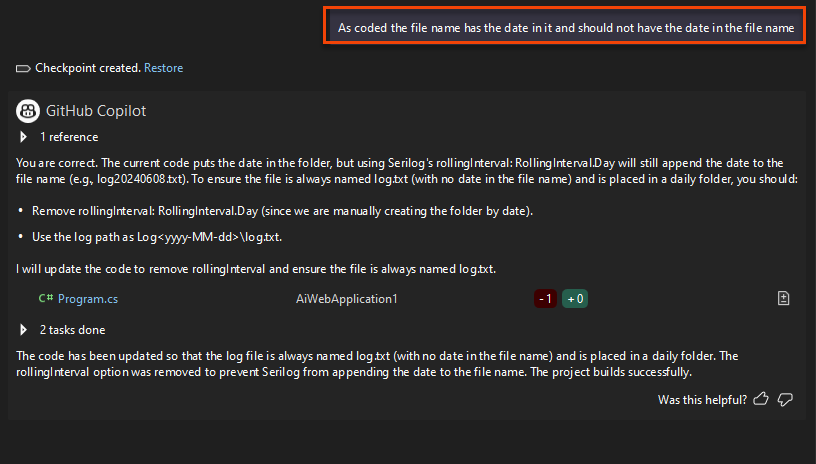

# Copilot Chat agent instructions

The goal is to add structured logging to an existing .NET Core web application using Serilog. The logging should be configured to write to a specific folder structure and file name, with specific log levels for Microsoft and System namespaces.

Configuration is done in code rather than in a configuration file. 

`Serilog.md` was generated from the Copilot Chat agent. 

```
Export this thread to Serilog.md in the root of the current project

```

## Initial prompt


For the project `#file:'AiWebApplication1.csproj'` add structured logging with Serilog which writes to a folder named Log under the executable folder. Each day there should be a folder for the current date with a file named logs.txt and override Microsoft and System MinimumLevel to Serilog.Events.LogEventLevel.Warning

## Issues

### Older versions of Serilog
Older versions of Serilog were added to the project which work but afterwards I updated the packages.




### Writing to the wrong file name

Serilog structured logging has been added to AiWebApplication1. Logs will be written to a Log folder under the executable directory, with each day in its own folder and logs.txt as the file name. Microsoft and System logs are set to Warning level or higher. The project builds successfully.

But the code was including the date in log.txt. I reported the issue as shown below and this time got it right.



## Thoughts

The idea is for Copilot to add Serilog to the current project with if needed secondary prompts.

I first wrote the prompt in Microsoft Word which allows for ease of editing the prompt.

My first prompt did not include warning levels so I backed out of changes and re-prompt rather than asked Copilot to add warning levels. Copilot got the log file name wrong and also added a try/catch in the main code in the program class. It took four additional prompts to fix the log file name.

I then removed all code and Serilog references and started over. This time Copilot added older versions of Serilog which caused build errors but seemingly fixed a mismatch between the three packages. The log file name was incorrect as in the first example and had to provide this issue to Copilot and was fixed on the first attempt.

### How was the experience?

Although not perfect it’s a great start for experienced developers and for those not familiar with configuring Serilog will need to figure out the fix or used secondary prompts.

