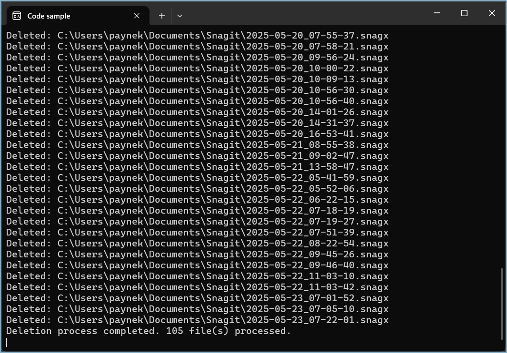
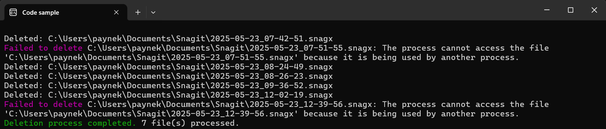

# About

This project is an example of creating a utility whose purpose is to remove unnecessary files from a folder where the criteria is to delete files that the base file name begins with the current year, with an extension of `.snagx`, which are automatically generated by the `SnagIt` screen-capturing tool. Excludes subfolders as there are no files that should be removed.

Of course, a developer can write code to perform what ChatGPT provided, but the goal is to use ChatGPT or GitHub Copilot to handle tasks like this so the developer can spend their time on actual tasks.

---

Here SnagIt has several files open.

