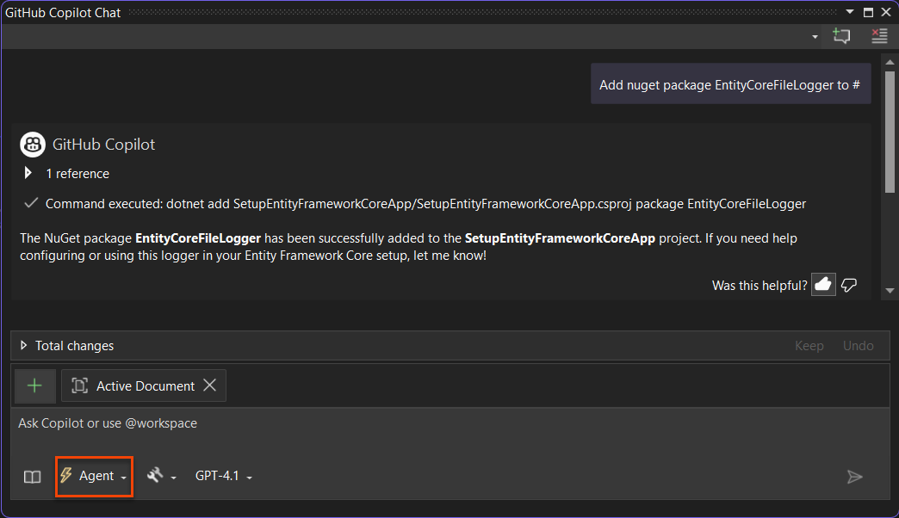
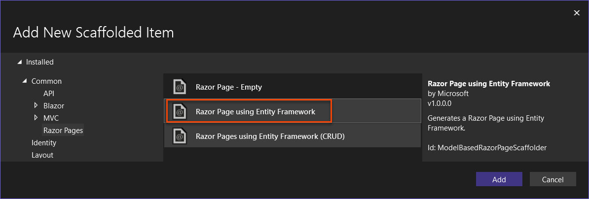
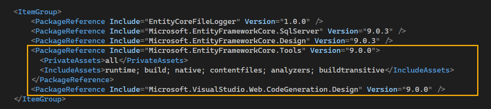
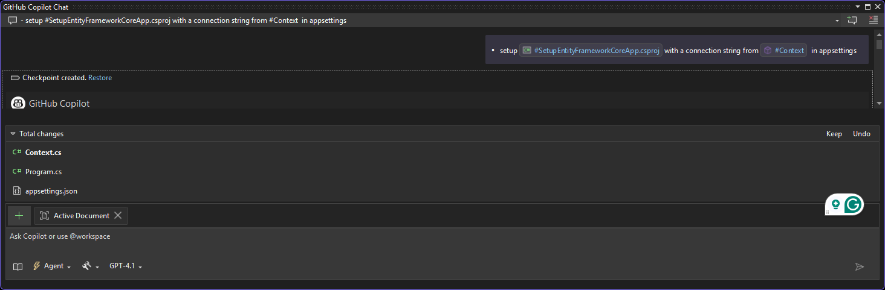
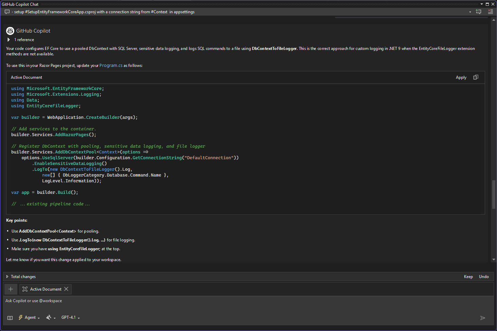
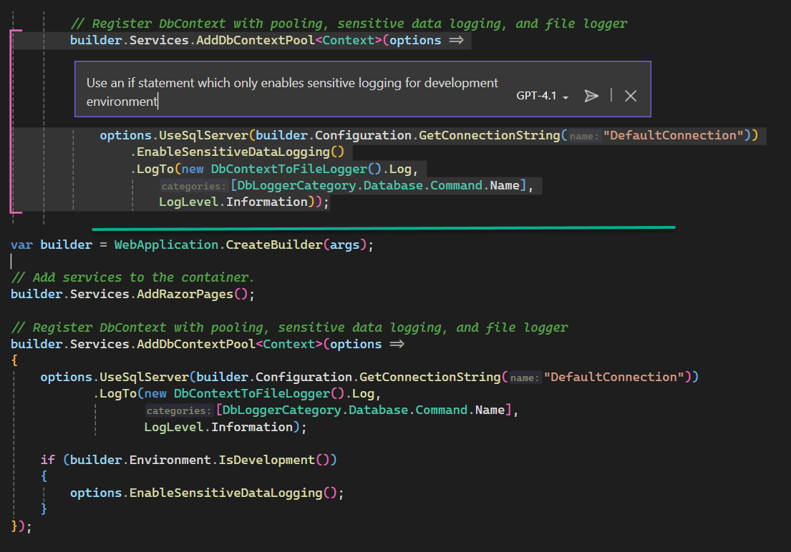

# About
<!--TOC-->
- [Pre-steps](#pre-steps)
  - [Add EF Core NuGet Package Reference](#add-ef-core-nuget-package-reference)
  - [Add new Razor page](#add-new-razor-page)
  - [Connection string](#connection-string)
  - [Logging configuration](#logging-configuration)
  - [Back to DbContext configuration](#back-to-dbcontext-configuration)
  - [Summary](#summary)
<!--/TOC-->
An experiment using GitHub Copilot to create a Razor page application using Entity Framework Core with a file logger.

> **Note**
> To run this project first run the SQL script in the `Scripts` folder to create the database and tables. 

# Pre-steps

- Used EF Core Power Tools to scaffold the database context and entity classes from an existing database.
- Added database scripts to project


## Add EF Core NuGet Package Reference

Add nuget package EntityCoreFileLogger to #SetupEntityFrameworkCoreApp.csproj




The NuGet package EntityCoreFileLogger has been successfully added to the SetupEntityFrameworkCoreApp project. If you need help configuring or using this logger in your Entity Framework Core setup, let me know!

---

Add required NuGet packages for Microsoft.EntityFrameworkCore.Design to #file:'SetupEntityFrameworkCoreApp.csproj' 

Once this was completed only one package was added (see below).

```xml
<PackageReference Include="Microsoft.EntityFrameworkCore.Design" Version="9.0.3" />
```

## Add new Razor page




Page name ViewModel.cshtml

Next, scaffolding process added the following packages automatically.



## Connection string

setup `#SetupEntityFrameworkCoreApp`  with a connection string from `#Context.cs`   in appsettings

```json
{
  "Logging": {
    "LogLevel": {
      "Default": "Information",
      "Microsoft.AspNetCore": "Warning"
    }
  },
  "AllowedHosts": "*",
  "ConnectionStrings": {
    "DefaultConnection": "Data Source=(localdb)\\MSSQLLocalDB;Initial Catalog=NorthWind2024;Integrated Security=True;Encrypt=False"
  }
}
```

The agent added dependency injection for the DbContext in the `#Program.cs` file.

```csharp
namespace SetupEntityFrameworkCoreApp;

using Microsoft.EntityFrameworkCore;
using Data;

public class Program
{
    public static void Main(string[] args)
    {
        var builder = WebApplication.CreateBuilder(args);

        // Add services to the container.
        builder.Services.AddRazorPages();
        
        // Register DbContext with connection string from configuration
        builder.Services.AddDbContext<Context>(options =>
            options.UseSqlServer(builder.Configuration.GetConnectionString("DefaultConnection")));

        var app = builder.Build();

```



## Logging configuration

Here we needed to provide an example

https://github.com/karenpayneoregon/web-app-code-samples/blob/58c0a40a3d6c2ec20c6a95c5a3de4ab61d4d5938/NotesRazorApp/Program.cs?plain=1#L15C1-L18C58

Otherwise Copilot provided incorrect code that would fail to compile.



Copilot asked for DbContextToFileLogger source so I provided the following link

https://github.com/karenpayneoregon/ef-code-8-samples/blob/master/EntityCoreFileLogger/DbContextToFileLogger.cs

From the source Copilot recommended that the log folder code to create the folder be included.

```csharp
using System;
using System.Diagnostics;
using System.IO;

namespace EntityCoreFileLogger
{
    public class DbContextToFileLogger
    {
        private readonly string _logFilePath;

        public DbContextToFileLogger()
        {
            var logDirectory = Path.Combine(AppDomain.CurrentDomain.BaseDirectory, "LogFiles", DateTime.Now.ToString("yyyy-MM-dd"));
            Directory.CreateDirectory(logDirectory); // Ensure directory exists

            _logFilePath = Path.Combine(logDirectory, "EF_Log.txt");
        }

        public void Log(string log)
        {
            try
            {
                using (var writer = File.AppendText(_logFilePath))
                {
                    writer.WriteLine($"{DateTime.Now:HH:mm:ss.fff} {log}");
                }
            }
            catch (Exception ex)
            {
                Debug.WriteLine($"Logging failed: {ex.Message}");
            }
        }
    }
}
```

I did not want that instead I added the following code to the project file to create the folder.

```xml
<Target Name="MakeLogDir" AfterTargets="Build">
   <MakeDir Directories="$(OutDir)LogFiles\$([System.DateTime]::Now.ToString(yyyy-MM-dd))" Condition="'$(Configuration)' == 'Debug'" />
</Target> 
```

## Back to DbContext configuration

Since most applications should not expose sensitive data, I asked Copilot only log sensitive information for `builder.Environment.IsDevelopment()`



## Summary

For this exercise, the only real issue was with EF Core logging and can understand this as the logging code came from a NuGet package, otherwise all went well.